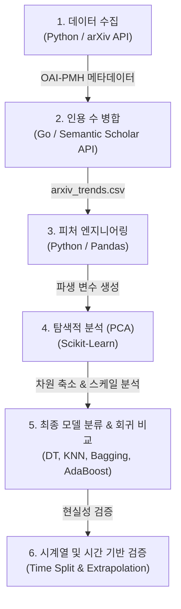
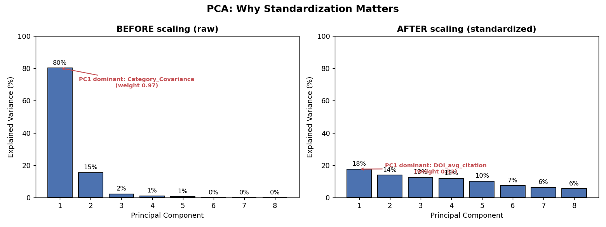
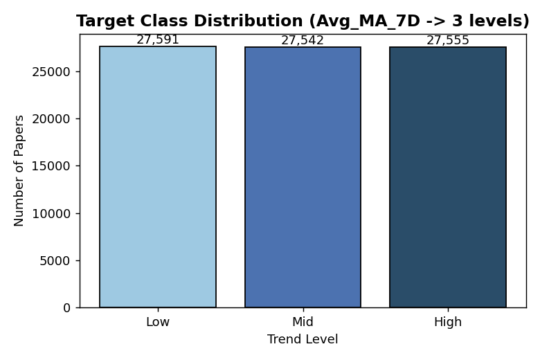
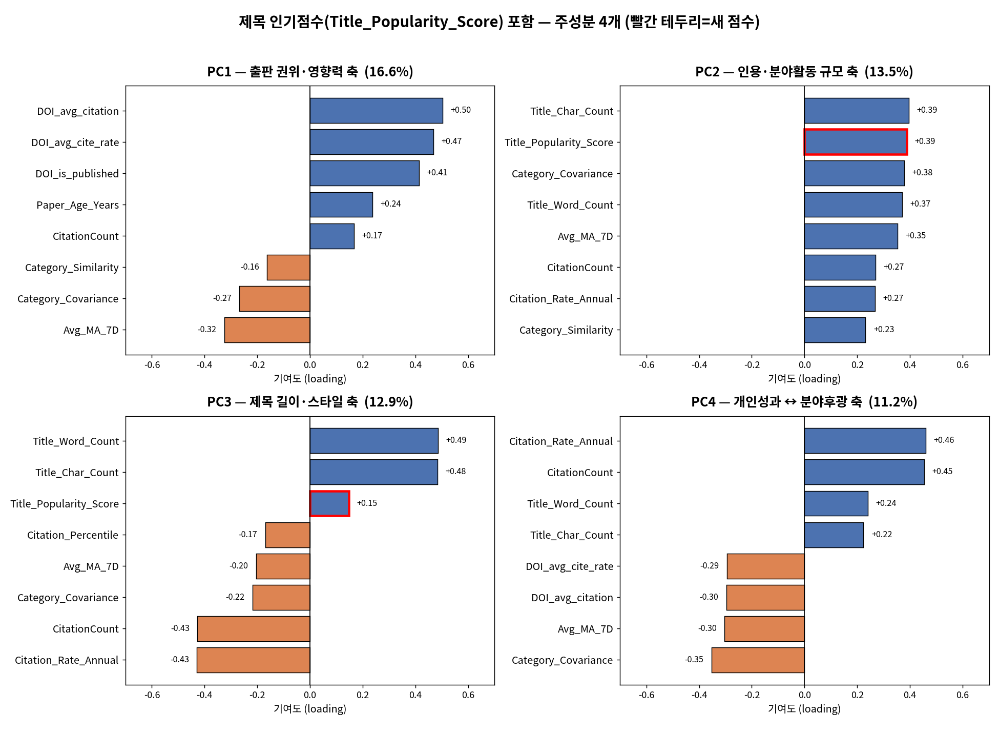
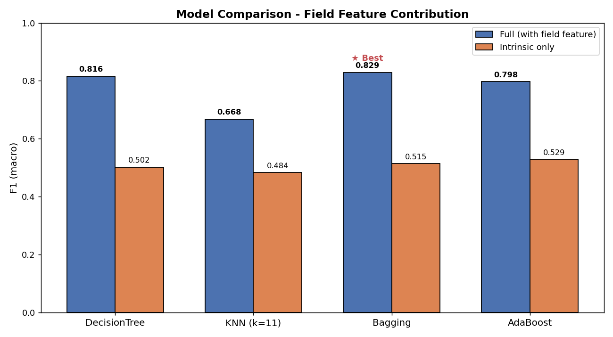
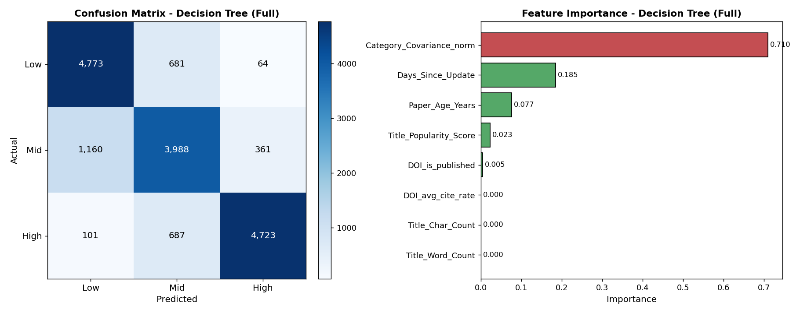
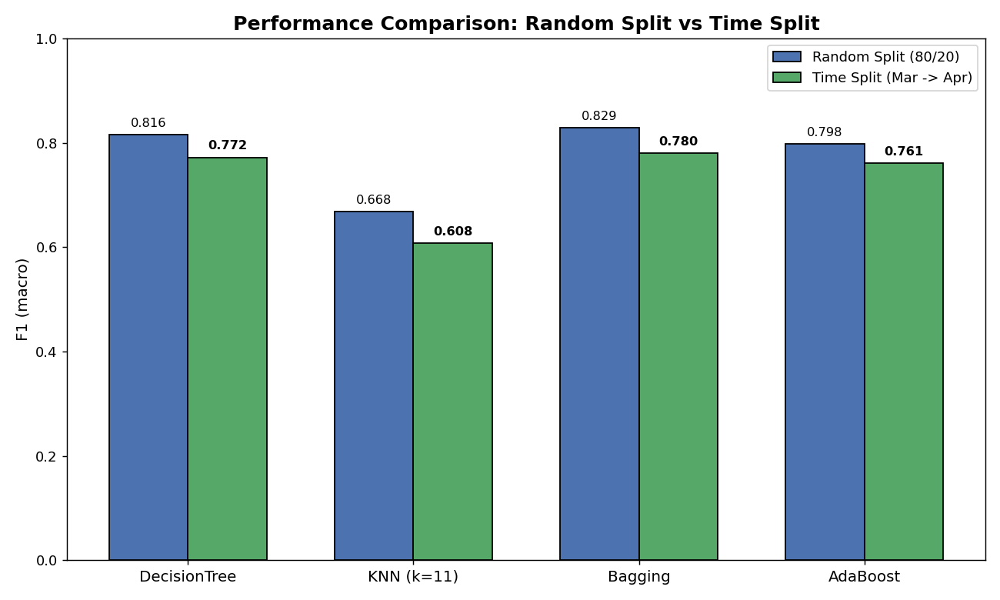
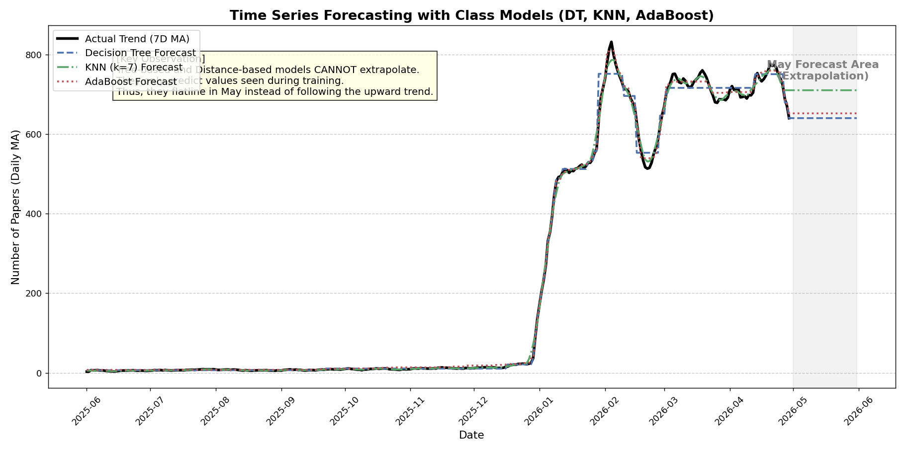
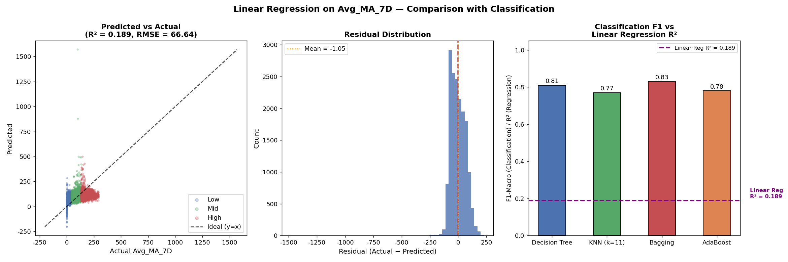

# TrendXiv: 주성분분석 및 트렌드 분류를 활용한 arXiv 논문 파급력 예측
> **arXiv Paper Trend Prediction using PCA and Machine Learning Classifiers**  

---

## 디렉토리 구조

```
TrendXiv/
├── LICENSE                            # CC BY-NC 4.0 라이선스 전문
├── README.md                          # 프로젝트 종합 소개 (본 파일)
├── .gitignore                         # 대용량 CSV, .env 등 제외 설정
│
├── src/                               # 소스코드
│   ├── collect/                       # 1단계: OAI-PMH API 데이터 수집
│   │   └── main.py
│   ├── merge/                         # 2단계: SS API로 인용 데이터 병합 (Go)
│   │   ├── merge_citations.go
│   │   └── .env
│   ├── preprocess/                    # 3단계: 피처 엔지니어링 & 텍스트 점수 산출
│   │   ├── preprocess.py
│   │   └── title_word_count.py
│   └── analysis/                      # 4단계: PCA 분석 & 모델 평가 & 외삽 분석
│       ├── add_title_score.py
│       ├── pca_analysis.py
│       ├── final_model.py
│       ├── time_split_model.py
│       ├── forecast_trend.py
│       └── forecast_trend_class_models.py
│
├── data/                              # 수집 데이터 폴더 (.gitignore 대상)
│   └── arxiv_trends.csv
│
├── docs/                              # 프로젝트 기술 백서 및 분석 가이드
│   ├── code_documentation.md          # 소스코드 상세 해설 백서
│   ├── technical_documentation.md     # Go 병합 모듈 상세 가이드
│   ├── csv_preprocessing_guide.md     # CSV 처리 아키텍처 가이드
│   ├── trend_features_documentation.md # 전처리 변수 수식/설명
│   ├── 프로젝트_진행정리.md              # 분석 과정 히스토리 정리
│   └── data_flow.json                 # 데이터 전반의 흐름 설정
│
├── outputs/                           # 분석 산출물
│   ├── csv/                           # 중간 정제 CSV 및 캐시 파일 (.gitignore 대상)
│   └── figures/                       # 시각화 그래프 이미지 (Git 추적 대상)
│
└── presentation/                      # 발표 자료
    ├── presentation_final.html        # HTML 슬라이드 자료 (16 slides)
    ├── presentation_final.pdf         # PDF 슬라이드 자료
    └── presentation.pdf
```

---

## 설치 및 실행 가이드

### 1. 데이터 병합 (Go 언어 필요)
```bash
cd src/merge
# .env 파일에 Semantic Scholar API Key 설정 필요
go run merge_citations.go
```

### 2. 피처 전처리 및 분석 (Python 패키지 필요: pandas, scikit-learn, matplotlib)
```bash
# 피처 엔지니어링 수행
python src/preprocess/preprocess.py
python src/preprocess/title_word_count.py

# 제목 인기 점수 결합 및 PCA 분석
python src/analysis/add_title_score.py
python src/analysis/pca_analysis.py

# 최종 머신러닝 분류기 학습 및 검증 (5-Fold 교차검증 포함)
python src/analysis/final_model.py
python src/analysis/time_split_model.py

# 외삽 한계 시각화 및 트렌드 예측
python src/analysis/forecast_trend_class_models.py
python src/analysis/forecast_trend.py
```

---

## 프로젝트 소개 및 문제 제기

최근 AI 및 다양한 과학 기술 분야의 급격한 발전으로 arXiv에 등록되는 논문의 수가 기하급수적으로 증가하고 있습니다. 매일같이 쏟아지는 수많은 논문 속에서 "어떤 논문이 향후 일주일간 학계와 대중의 주목(트렌드)을 받을 것인가?"를 사전에 예측하는 것은 연구자들의 정보 탐색 효율을 극대화하는 데 매우 중요합니다.

TrendXiv 프로젝트는 약 82,688건의 arXiv CS 분야 논문 데이터를 기반으로, 논문의 고유 특징과 학문 분야의 특성을 다각도로 융합하여 단기 트렌드 지수(Avg_MA_7D)를 예측하고 분류하는 파이프라인을 구축했습니다.

---

## 프로젝트 파이프라인



- **언어**: Python (Pandas, Scikit-Learn, Matplotlib), Go (API 병합기)
- **수집 데이터**: 2025년 ~ 2026년 4월 arXiv 논문 메타데이터 및 인용 데이터 총 82,688건

---

## 데이터 정규화 및 표준화 설계 (Methodology)

본 프로젝트는 단순 머신러닝 모델 투입을 넘어, 데이터가 가진 도메인 편향과 수학적 스케일 문제를 해결하기 위해 두 가지 다른 정규화 기법을 도입했습니다.

### 1. PCA와 표준화(Standardization)의 관계
* **PCA의 성격**: PCA는 그 자체로 정규화 기법이 아닙니다. PCA는 다차원 데이터의 공분산 행렬을 고유값 분해하여 분산이 최대화되는 직교 축을 찾아 차원을 축소하는 기법입니다.
* **표준화(StandardScaler) 선행의 필수성**: PCA는 각 피처의 분산 크기에 매우 민감합니다. 
  - **표준화 전 (Before Scaling)**: 분산이 압도적으로 큰 `Category_Covariance` (표준편차 약 252) 변수가 첫 번째 주성분(PC1)의 80.2% 이상을 독점하여, 사실상 단일 변수 분석과 다름없는 결과를 보였습니다.
  - **표준화 후 (After Scaling)**: 모든 변수의 평균을 0, 표준편차를 1로 맞춘 뒤 PCA를 수행하자, PC1의 설명력이 17.6%로 완화되며 다양한 피처들이 균형 있게 기여했습니다.
  - **결과 시각화**:  
    

### 2. 분야 지배효과 보정 (Category_Covariance_norm)
AI/ML(예: `cs.CL`, `cs.CV`)과 같은 거대 카테고리는 분야 자체의 규모가 커 논문 개별 특성과 상관없이 인용 수나 트렌드 지수가 매우 높게 나타나는 분야 지배효과(Confounder)가 있습니다.
- 이를 해결하기 위해 개별 논문의 공분산(`Category_Covariance`)을 해당 카테고리의 평균 공분산으로 나누어 준 `Category_Covariance_norm` 피처를 설계했습니다.
- 이를 통해 카테고리 본연의 규모 효과를 통제하고, 해당 분야 내에서 해당 논문이 가지는 상대적 동조성을 추출했습니다. (타겟과의 상관관계가 0.817에서 0.276으로 완화되어 과적합 위험을 낮춤)

---

## 타겟 변수 및 클래스 분할 (Class Distribution)

초기 타겟이었던 `CitationCount`는 논문의 나이가 많을수록 인용 수가 누적되는 시간 편향(Time Bias)이 심각했습니다 (출판 3개월 이내 평균 2.1회 vs 5년 이상 평균 28.2회).  
이를 보정하기 위해 카테고리별 7일 이동평균 수치인 `Avg_MA_7D`를 타겟 변수로 선정했습니다.

### 클래스 균등 분할
1. **분할 방식**: `Avg_MA_7D` 연속형 변수를 3분위수(Percentile 33.3%, 66.7%) 기준으로 쪼개어 `Low`, `Mid`, `High` 3개 클래스로 변환했습니다.
2. **클래스 비율**: 1 : 1 : 1 (각 클래스별 약 27,550건)로 완벽하게 균등 분할을 달성했습니다.
3. **효과**: 불균형 데이터셋에서 발생할 수 있는 소수 클래스 예측 무시 문제를 사전에 방지하여, F1-Score 및 Accuracy의 왜곡 없는 강건한 평가지표 확보에 기여했습니다.
- **분포 시각화**:  
  

---

## Title_Popularity_Score 분석 결과

논문 제목에 포함된 단어들의 전체 빈도 분석 사전을 기반으로, 해당 제목의 단어들이 얼마나 인기 있는지를 수치화한 `Title_Popularity_Score`를 개발하여 탐색을 진행했습니다.

- **Scree Plot 80% 기여 여부**: 16개 피처로 확장하여 PCA를 재실행했을 때, 누적 설명 분산 80% 이상을 도달하기 위한 주성분 개수는 기존 15개 피처와 동일하게 7개였습니다. 또한, 주성분 로딩 벡터 분석 결과 `Title_Popularity_Score`는 PC2(인용·분야활동 규모 축, loading +0.39)에 강력하게 관여함을 확인했습니다. (분산 설명력 80% 경계 내부 기여)
  - **점수 포함 PCA 결과**:  
    
- **최종 모델 배제 사유**: PCA의 기여도와 별개로, 지도학습 모델(Decision Tree 등)을 통해 학습시켰을 때 Feature Importance가 0에 가깝게 수렴하여 실제 분류 예측 성능 향상에는 유의미한 도움을 주지 못했습니다. 
- **인사이트**: 비지도 학습 상의 주성분 공간에서의 수학적 기여도와 지도 학습에서의 타겟 분류 성능을 올리는 변수 중요도는 서로 일치하지 않을 수 있음을 보여주는 정량적 증거입니다.

---

## 모델링 및 평가 결과 (Model Evaluation)

### 1. 모델별 성능 비교 (80/20 Holdout & 5-Fold Stratified CV)
단일 홀드아웃 분할로 인한 성능 왜곡을 막기 위해 전체 데이터에 대해 5-Fold Stratified Cross-Validation (교차검증)을 수행하여 신뢰성을 확보했습니다.

| 모델명 | Holdout Accuracy | Holdout F1 (macro) | 5-Fold CV F1 (macro) | 비고 |
| :--- | :---: | :---: | :---: | :--- |
| **DecisionTree** | 0.812 | 0.809 | 0.809 (±0.002) | 파라미터: max_depth=8, min_samples_leaf=50 |
| **Bagging** | 0.829 | 0.816 | 0.816 (±0.002) | 기저모델: DT (depth=8, n_estimators=50) Best |
| **KNN (k=11)** | 0.683 | 0.675 | 0.671 (±0.003) | 스케일 민감성 존재, 상대적 저조 |
| **AdaBoost** | 0.798 | 0.798 | 0.796 (±0.002) | 기저모델: DT (depth=4, n_estimators=100) |

- **모델 비교 시각화**:  
  

### 2. 왜 세 클래스(Low, Mid, High)의 점수는 비슷하며, 혼동행렬의 양상은 어떠한가?
- **점수가 고른 원인**: 타겟 데이터의 클래스가 33%씩 정확히 균등 분할되어 학습되었기 때문에 baseline 성능이 33.3%로 일정하게 설정되고, 특정 클래스에 모델의 예측 편향이 쏠리지 않아 전반적으로 고른 점수를 나타냅니다.
- **세부 클래스 예측 거동 (혼동행렬 분석)**:
  - **Low vs High 양극단**: 두 클래스는 피처 특성상 매우 명확하게 분리되어 서로 오분류하는 비율이 극히 적습니다.
  - **Mid (중간 클래스)**: 트렌드 변화가 연속적이기 때문에 Mid는 Low와 High의 중간 경계에 위치합니다. 이로 인해 Low 혹은 High로 오분류되는 빈도가 가장 높습니다.
  - **결과 시각화**:  
    

---

## 피처와 트렌드 간의 비선형성 상세 분석 (Why Non-linear?)

동일한 8개 피처로 타겟 값인 `Avg_MA_7D`를 직접 회귀 예측하게 한 선형회귀(Linear Regression) 모델의 설명력(R²)은 0.19에 불과했습니다. 반면, 의사결정트리(Decision Tree)와 배깅(Bagging) 등 비선형 분류 모델은 F1-Score 0.81 이상의 뛰어난 분류 능력을 보였습니다. 이처럼 피처와 트렌드 간의 강한 비선형성이 발생하는 근본적인 이유는 다음과 같습니다.

### 1. 다차원 상호작용(Interaction) 효과의 지배성
논문의 파급력(트렌드)은 개별 변수가 단순히 합산되어 올라가지 않습니다. 여러 조건이 결합하여 일종의 스위치 작용을 함으로써 폭발하게 됩니다.
- 예: 특정 분야가 학계에서 높은 인기(`Category_Covariance_norm`이 큼)를 누리고 있더라도, 논문이 등록된 지 너무 오래되었거나(`Days_Since_Update`가 큼) 정식 학회에 출판되지 않은 상태(`DOI_is_published` = 0)라면 대중적인 트렌드가 되기 힘듭니다.
- 즉, (분야 인기도가 높음) AND (최신 논문임) AND (정식 출판됨)과 같은 다차원 조건부 AND 관계가 지배적입니다. 
- 선형회귀 모델은 Y = w1*X1 + w2*X2 + ... 와 같이 각 변수의 개별 가중치 합(Linear Combination)으로만 예측을 생성하므로, 이러한 변수 간의 복잡한 시너지 및 상호작용을 포착하는 데 원천적인 한계가 있어 낮은 R² 값을 갖습니다.

### 2. 피처의 한계/임계값(Threshold) 효과 및 최적값 구간
선형 관계는 입력값이 증가하면 출력값도 영원히 일정한 비율로 비례하여 증가한다고 가정하지만, 현실 데이터는 그렇지 않습니다.
- **역U자형 비선형 관계 (최적 구간)**: 논문 제목의 글자 수(`Title_Char_Count`)나 단어 수(`Title_Word_Count`)의 경우, 너무 짧으면 정보가 부족하고 너무 길면 시인성이 떨어져 도달율이 감소합니다. 즉, 특정 범위(예: 10~15 단어)에서 관심도가 가장 높고 양쪽 극단으로 갈수록 떨어지는 비선형 관계를 보입니다.
- **지수적 감소 (Exponential Decay)**: 논문의 나이(`Paper_Age_Years`) 및 업데이트 후 경과일(`Days_Since_Update`)에 따른 파급력 수치는 시간이 경과함에 따라 완만하게 선형으로 감소하지 않고, 초기 며칠 사이에 급격히 떨어지다가 오랜 기간 완만하게 유지되는 강력한 비선형적 감소 거동을 보입니다.

### 3. 의사결정트리 계열 모델의 우수성
의사결정트리(Decision Tree) 기반 모델은 데이터를 여러 개의 독립적인 임계값(Threshold) 기준으로 반복하여 하위 분할하는 구조를 가집니다.
- 이는 자연스럽게 상기한 임계값 효과 및 다차원 변수 간의 상호작용(IF-THEN 구조의 분기 결합)을 복잡한 수학적 가설 검정 없이도 손쉽게 근사(Approximation)할 수 있습니다.
- 결과적으로 이러한 데이터의 고유한 비선형 결합 관계가 선형회귀(R²=0.19) 대비 트리 분류기(F1=0.81)의 월등한 성능 우위를 설명하는 핵심 이유입니다.

---

## 현실 적용성 검증 (Time Split)

무작위 데이터 분할은 과거와 미래가 무작위로 섞여 미래 정보가 과거 학습에 사용되는 미래 참조(Data Leakage) 문제를 야기합니다. 이를 철저히 통제하고 실제 서비스 환경에 배포했을 때의 안정성을 평가하기 위해 시간 기반 분할을 수행했습니다.

- **Train Set (과거)**: ~ 2026-03-31 이전 등록 논문 (61,842건)
- **Test Set (미래)**: 2026-04-01 ~ 2026-04-30 최신 논문 (20,846건)
- **검증 결과**:
  - **DecisionTree F1**: 0.809 (Holdout) -> 0.772 (Time Split)
  - **Bagging F1**: 0.816 (Holdout) -> 0.780 (Time Split)
- **해석**: 무작위 분할 대비 약 3~4%의 F1-Score 하락이 발생했으나, 실제 비즈니스 환경에서 방어력 있는 수준(F1 0.78)의 강건함을 보여주었습니다.
- **검증 시각화**:  
  

---

## 프로젝트 한계점 (Limitations)

### 1. 트리/거리 기반 모델의 외삽(Extrapolation) 한계
수업 시간에 주로 학습한 의사결정트리(DT), KNN, AdaBoost 등의 모델은 훌륭한 분류 능력을 지녔지만, 미래 시점의 논문 발생량 추이를 예측하는 회귀 기반 시계열 Forecasting에는 치명적인 한계가 있습니다.
- **Flatline 현상**: 2026년 5월 이후의 누적 증가 추세를 예측해 본 결과, 트리 및 거리 모델들은 학습용 피처 범위 밖의 수치를 학습하지 못해 예측선이 미래 영역에서 완전히 평평하게 수평선으로 꺾여버리는 외삽 불능(Flatline) 문제를 드러냈습니다.
- **외삽 한계 시각화**:  
  

### 2. 분야(Category) 특성에 대한 과도한 의존성
- 분야 지배효과를 보정하는 정규화(`Category_Covariance_norm`)를 적용했음에도 불구하고, 여전히 Feature Importance 상에서 분야 정체성 피처의 기여도가 약 0.68 ~ 0.71로 절대적입니다.
- 실제로 이 피처를 제거하고 논문 고유 피처(Intrinsic)로만 학습할 경우, 모델의 F1-Score는 0.48 수준으로 급락합니다. 이는 모델이 논문 개별 정보보다는 논문이 속한 카테고리가 핫한 카테고리인가에 극도로 의존하고 있음을 시사합니다.

### 3. 선형 모델 R²=0.19 한계
- 동일한 8개 피처를 연속형 `Avg_MA_7D` 타겟에 선형회귀(Linear Regression)를 적용했을 때, 설명력(R²)은 0.19에 불과했습니다.
- 이는 앞서 규명했듯 피처와 트렌드의 관계가 매우 복잡한 비선형(Non-linear) 구조 및 상호작용으로 이루어져 있어 단순 선형결합으로는 설명이 극히 어려움을 의미합니다.
- **선형회귀 결과**:  
  

---

## 해결 가능성 및 향후 개선 방향 (Future Work)

1. **외삽 가능한 시계열 모델 도입**:
   - 트리 기반 모델의 한계를 극복하기 위해, 통계적 모델인 ARIMA, SARIMAX나 메타의 Prophet을 도입하여 거시적 트렌드 추세선을 예측할 수 있습니다.
   - 단기 변동성과 장기 외삽 능력을 동시에 잡기 위해 LSTM이나 Temporal Fusion Transformer(TFT) 등 딥러닝 기반 시계열 모델을 도입할 수 있습니다.
2. **SciBERT/SPECTER를 이용한 고수준 텍스트 피처 추출**:
   - 단순히 제목 글자 수, 단어 수, 단어 빈도 기반 점수에 그쳤던 텍스트 분석을 개선할 수 있습니다.
   - 학술용으로 사전 학습된 SciBERT나 논문 관계망 임베딩 모델인 SPECTER를 활용하여, 제목과 초록(Abstract)의 텍스트로부터 고차원 의미론적 임베딩 피처를 추출해 투입하면 분야 피처 의존성을 대폭 낮출 수 있습니다.
3. **저자 파급력 및 연구 네트워크 특징 추가**:
   - 논문의 개별 파급력 예측을 돕기 위해, 주 저자의 H-index, 이전 총 인용 수 등을 추가 반영합니다.
   - 논문 간의 공동 연구 및 저자 인용 그래프 네트워크를 생성하고, PageRank나 Graph Centrality(중심성) 지표를 피처로 생성하여 논문 고유의 전파력을 다각도로 모델링할 수 있습니다.
4. **롤링 윈도우 기반 시계열 교차검증 적용**:
   - 단일 시점(3월 학습 -> 4월 테스트)의 Time Split 한계를 보완하기 위해, 윈도우를 밀어가며 반복 평가하는 Time Series Split (롤링 윈도우 교차 검증)을 설계하여 시계열 모델의 시간적 안정성을 극대화합니다.

---

## 참고문헌 (References)

- arXiv.org. (n.d.). *arXiv API User's Manual*. https://arxiv.org/help/api/index
- Allen Institute for AI. (n.d.). *Semantic Scholar Academic Graph API*. https://www.semanticscholar.org/product/api
- Tan, P. N., Steinbach, M., & Kumar, V. (2018). *Introduction to Data Mining* (2nd Edition). Pearson.
- Pedregosa, F., Varoquaux, G., Gramfort, A., Michel, V., Thirion, B., Grisel, O., ... & Duchesnay, E. (2011). Scikit-learn: Machine learning in Python. *Journal of Machine Learning Research*, 12, 2825-2830.

---

## 라이선스 (License)

본 프로젝트의 소스 코드 및 산출물은 Creative Commons Attribution-NonCommercial 4.0 International (CC BY-NC 4.0) 라이선스에 따라 배포됩니다.
- **이용 조건**: 저작자 표시(Attribution)를 준수해야 하며, 상업적 목적(Non-Commercial)으로 이용할 수 없습니다.
- **라이선스 부합성 검증**: 데이터 수집 및 제공처인 arXiv API와 Semantic Scholar API는 공통적으로 비상업적 학술 연구 목적에 한해 데이터 조회 및 수집을 무료로 허용하고 있습니다. 따라서 원본 데이터 제공처의 이용약관 및 라이선스 정책을 위배하지 않기 위해 상업적 목적의 이용이 전면 금지되는 **CC BY-NC 4.0** 라이선스를 적용하였습니다.
