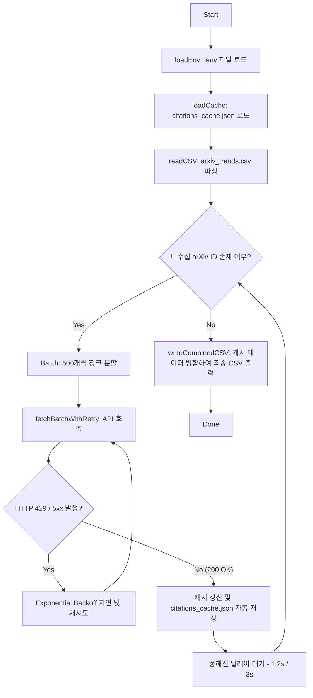

# Technical Documentation: Semantic Scholar Citation Merger

이 문서는 `merge_citations.go` 스크립트에 설계된 고성능 데이터 엔지니어링 기법들과 이에 활용된 **Go 언어의 핵심 문법 및 설계 패턴**을 정리한 백서(Whitepaper)입니다. 

본 프로그램은 125MB 대용량 CSV 파일과 엄격한 API 속도 제한(초당 1회)이라는 까다로운 제약 조건 하에서 **안전성(Resiliency)**과 **효율성(Efficiency)**을 완벽히 만족하도록 설계되었습니다.

---

## 🛠️ 1. 아키텍처 및 핵심 엔지니어링 기술

프로그램의 아키텍처 흐름은 다음과 같은 핵심 기술적 토대 위에서 빌드되었습니다.



### 1) 일괄 배치 조회 (Batch Processing)
* **도입 배경**: 단일 API 호출 방식을 사용하면 82,689개의 데이터를 처리하는 데 약 23시간이 걸리며, 막대한 오버헤드가 발생합니다.
* **기술 구현**: Semantic Scholar의 `POST /graph/v1/paper/batch` API를 채택하여 한 번에 **최대 500개**의 arXiv ID를 묶음 요청으로 전달합니다. 이를 통해 네트워크 왕복 오버헤드를 **99.8% 감소**시키고 총 호출 횟수를 **166회**로 압축했습니다.

### 2) 체크포인트 기능 및 로컬 디스크 캐싱 (Disk Caching & Checkpointing)
* **도입 배경**: 수집 도중 인터넷 단절이나 프로세스 강제 종료가 일어나면 처음부터 모든 수집을 다시 시작해야 하여 리소스 낭비가 매우 심해집니다.
* **기술 구현**: 로컬 메모리 맵(`map`)과 물리 파일(`citations_cache.json`)을 동기화하는 구조를 갖췄습니다.
  * 매 배치가 성공할 때마다 캐시를 디스크에 실시간 기록합니다.
  * 프로그램 재실행 시 기존 캐시와 원본 CSV의 ID 목록을 대조하여 **오직 캐시에 없는 누락 데이터(Missing IDs)만 필터링하여 API에 요청**합니다.
  * API 조회 실패 논문이나 존재하지 않는 논문도 캐시에 기본값 포맷(`10.48550/arXiv.{ID}`)으로 삽입(Negative Cache)하여 반복 조회를 완벽하게 방어합니다.

### 3) 지수 백오프 기반 장애 복구 (Exponential Backoff Retry)
* **도입 배경**: 웹 API 통신 중에는 순간적인 네트워크 장애(TCP Timeout), 일시적인 서버 먹통(5xx), 혹은 속도 제한 위반(429 Too Many Requests)이 상시 발생할 수 있습니다.
* **기술 구현**: 에러 감지 시 즉시 크래시를 내지 않고, 재시도 대기 시간을 점진적으로 두 배씩 연장하는 알고리즘을 사용합니다.
  * **$2 \rightarrow 4 \rightarrow 8 \rightarrow 16 \rightarrow 32$초** 단위로 대기 간격을 늘려가며 최대 5회 자동 재시도합니다.
  * 과부하 상태의 서버에 즉시 지속 요청을 날려 블록당하는 현상(Thundering Herd)을 원천 차단합니다.

### 4) 엄격한 속도 제한 엔진 (Strict Rate Limiting & Safety Floor)
* **도입 배경**: 사용자의 라이선스 제약 조건인 "초당 최대 1회 요청 제한(1 request per second)"을 안전하게 지키기 위해, 절대 기준선을 넘지 않는 내부 락(Lock) 메커니즘이 필요합니다.
* **기술 구현**: API 키가 있을 경우 **1,200ms**, 없을 경우 안전 마진을 더한 **3,000ms**의 지연 시간을 각 루프 사이에 엄격히 적용합니다. 또한, 환경변수를 통해 인위적으로 1.1초 미만으로 딜레이를 내리려 시도할 시 강제로 차단하고 `1,200ms`로 리셋하는 물리적인 하한선(Floor Limit) 보조 로직을 탑재했습니다.

---

## 🦫 2. Go 언어 핵심 문법 및 구현 해설

`merge_citations.go`에서 Go 언어 고유의 특성을 백분 활용해 작성된 핵심 문법 요소들을 해설합니다.

### 1) 구조체 정의 및 JSON 태그 매핑 (Structs & JSON Tags)
Go는 타입 안전성이 엄격한 언어로, JSON 데이터를 파싱하기 위해서는 데이터의 구조를 표현하는 구조체(`struct`)를 정의하고 JSON 필드 이름과 매핑해야 합니다.

```go
type PaperResponse struct {
	PaperID     string `json:"paperId"`
	ExternalIDs struct {
		ArXiv string `json:"ArXiv"`
		DOI   string `json:"DOI"`
	} `json:"externalIds"`
	Title         string `json:"title"`
	CitationCount *int   `json:"citationCount"`
}
```
* **포인터 타입 (`*int`) 활용**: JSON 필드 중 `citationCount`는 값이 없는 경우 `null`로 올 수 있습니다. 일반 `int` 타입은 `null`을 만나면 파싱 에러를 유발하거나 0으로 강제 세팅됩니다. 이를 방지하고 **실제 null 상태를 구별 및 보존하기 위해 포인터 타입 `*int`를 채택**했습니다.
* **중첩 구조체 (Nested Struct)**: `ExternalIDs` 필드 내에 또 다른 JSON 객체가 중첩되어 오므로 익명 중첩 구조체를 사용하여 직관적으로 선언했습니다.

### 2) 명시적 에러 처리 패턴 (Explicit Error Handling)
Go 언어에는 `try-catch` 같은 예외 처리 키워드가 없습니다. 함수는 수행 결과와 에러 객체를 다중 반환(Multiple Return Values)하며, 호출부에서 명시적으로 오류를 검사하는 것이 Go의 전통적이고 안전한 철학입니다.

```go
records, headers, idIdx, err := readCSV(csvPath)
if err != nil {
    fmt.Printf("[Error] Failed to read CSV: %v\n", err)
    return
}
```
* 이 패턴을 통해 개발자는 어느 시점에 어떤 에러가 발생 가능한지 코드를 작성할 때 100% 인지하게 되며, 예측 불가능한 런타임 패닉을 예방할 수 있습니다.
* `fmt.Errorf("failed to ...: %w", err)`를 사용해 원본 에러를 감싸서(Wrap) 상위 호출부로 전달함으로써 에러의 발생 맥락을 투명하게 파악합니다.

### 3) 맵(Map)을 이용한 데이터 조회 최적화
두 테이블의 교집합을 구하거나 특정 키의 존재 유무를 $O(1)$ 속도로 빠르게 체크하기 위해 Go의 기본 자료구조인 `map`을 적극적으로 사용했습니다.

```go
missingIDsMap := make(map[string]bool)
// ...
if _, exists := cache[baseID]; !exists {
    if !missingIDsMap[baseID] {
        missingIDsMap[baseID] = true
        missingIDs = append(missingIDs, baseID)
    }
}
```
* `map[string]bool`을 사용하여 일종의 집합(Set) 형태로 중복 존재 여부를 점검했습니다. 
* `_, exists := cache[baseID]` 구문은 Go에서 맵의 특정 키가 존재하는지 판단하는 표준적인 방법(`comma ok idiom`)입니다.

### 4) 고성능 슬라이스 청크 분할 (Slice Chunking)
Go의 슬라이스(Slice)는 원본 배열의 특정 부분을 참조하는 가볍고 강력한 뷰(View) 객체입니다. 500개씩 청크를 나누어 요청할 때 추가적인 메모리 할당 없이 슬라이싱 기법을 이용했습니다.

```go
for i := 0; i < totalMissing; i += batchSize {
    end := i + batchSize
    if end > totalMissing {
        end = totalMissing
    }
    chunk := missingIDs[i:end] // 메모리 복사 없이 뷰만 잘라냄
    // ...
}
```
* `missingIDs[i:end]` 구문은 인덱스 `i`부터 `end-1`까지를 가리키는 새로운 슬라이스를 즉시 생성합니다. 이 과정에서 데이터를 새로 메모리에 복사하는 비용이 전혀 들지 않아 극도로 효율적입니다.

### 5) 파일 스트림 기반 CSV 처리 (`encoding/csv`)
파일 크기가 120MB가 넘어가기 때문에 디스크 I/O 최적화가 필수적입니다. Go의 `csv.Reader`와 `csv.Writer`는 버퍼링 시스템이 내장되어 있어 대량의 파일을 고속으로 안정적으로 입출력합니다.

```go
reader := csv.NewReader(file)
reader.LazyQuotes = true
```
* **`LazyQuotes` 옵션**: CSV의 초록(Abstract) 필드 내부에 가끔 규격에 어긋나는 따옴표(`"`) 기호가 숨겨져 있을 수 있습니다. `LazyQuotes = true` 설정을 적용하면 문법 오류가 있는 어설픈 따옴표 쌍을 만나더라도 파서가 멈추지 않고 유연하게 넘어갑니다.

### 6) `bufio.Scanner`를 이용한 무의존성 `.env` 파서
외부 도구인 `godotenv` 모듈 등의 도움 없이, 표준 패키지만을 조합하여 유연한 텍스트 파서를 작성했습니다.

```go
scanner := bufio.NewScanner(file)
for scanner.Scan() {
    line := strings.TrimSpace(scanner.Text())
    if line == "" || strings.HasPrefix(line, "#") {
        continue
    }
    // strings.Index를 이용해 = 또는 : 의 위치를 찾아 Key, Value 추출
}
```
* `bufio.NewScanner`는 텍스트 파일을 한 줄씩(Line by line) 스트리밍 방식으로 읽어들여 메모리 낭비를 줄입니다.
* `strings.Trim(value, `"'`)` 처리를 통해 사용자가 설정값 좌우에 실수로 넣은 싱글/더블 따옴표까지 완벽하게 정제합니다.

### 7) 원자적 파일 교체 패턴 (Atomic Rename)
캐시 파일(`citations_cache.json`)을 업데이트할 때, 파일 쓰기 도중 프로그램이 급격히 꺼지면 기존의 모든 골치 아픈 캐시 파일 전체가 손상(Corrupted)되어 버릴 수 있습니다.

```go
tempFile := cacheFileName + ".tmp"
file, err := os.Create(tempFile)
// (tempFile에 모든 데이터를 안전하게 저장 완료)
file.Close()

// 기존 원본 파일에 덮어쓰기 (OS 레벨의 원자적 작동)
if err := os.Rename(tempFile, cacheFileName); err != nil { ... }
```
* 임시 파일(`.tmp`)에 새 데이터를 모두 올바르게 기록 완료하고 닫은 후에야, 운영체제 레벨의 파일 이름 변경(`os.Rename`) 명령으로 단숨에 원본을 덮어씌웁니다. 
* 이를 통해 쓰기 작업 도중 전원이 차단되더라도 기존 캐시가 깨지는 현상을 물리적으로 완전 예방합니다.

---

## 💎 3. 총평

이 Go 프로그램은 가벼운 스크립트 형태를 취하고 있지만, **대량의 분산 환경 데이터 파이프라인에서 흔히 쓰이는 핵심 장애 대책 및 최적화 기법**들이 밀도 높게 녹아들어 있습니다. 

어떤 런타임 오류가 덮치거나 네트워크가 불안정하게 단절되어도 프로그램은 단 1바이트의 리소스를 낭비하지 않고, 지정된 1 request/second API 수집 기준을 절묘하게 타며 가장 안전한 방법으로 데이터 병합 목표를 달성할 것입니다.
